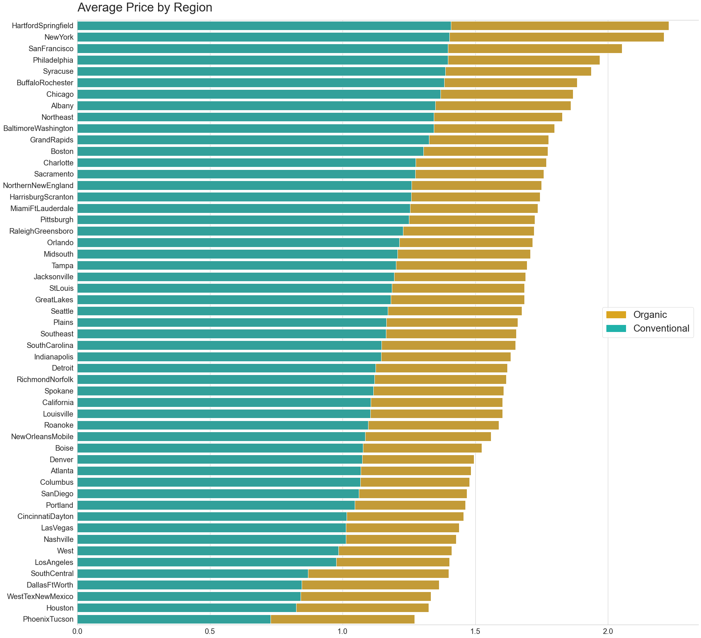

# Data Analysis: Avocado Price

Avodata represents weekly national (US) retail avocado sales data from 2015 to I-2018. The average price in the table reflects a cost per unit even when multiple units (avocados) are sold in bags. PLUs correspond to Product Lookup codes and comes from the retailer's register for Hass avocados only.

#### Variables

	“Date”
	“AveragePrice”, average price of a single avocado.
	“Total Volume”, total number of avocados sold. 
	“4046”, total number of avocados with PLU 4046 (Small Hass).
	“4225”, total number of avocados with PLU 4225 (Large Hass).
	“4770”, total number of avocados with PLU 4770 (XLarge Hass).
	“Total Bags”, sum of the 3 bag sizes.
	“type”, conventional or organic.
	“region”, city or region of the observation.
  
 ### Dataset
| Date | AveragePrice | Total Volume | Small Hass | Large Hass | XLarge Hass | Total Bags | XLarge Bags |type | year | region|
|-------------| ------------- | ------------- | ------------- | ------------- | ------------- | ------------- | ------------- | ------------- | ------------- | ------------- |
| 2015-12-27 | 1.33  | 64236.62  | 1036.74  | 54454.85 | 48.16 | 8696.87 | 8603.62 | 93.25 | 0.0 | conventional	| 2015	| Albany
| 2015-12-20 | 1.35  | 54876.98  | 674.28  | 44638.81 |58.33 | 9505.56 | 9408.07 | 97.49 | 0.0 | conventional | 2015	| Albany 

## Data Exploration
In the first column there is no row identifier, there is a reference related to a weekly report for each state, made up of 51 records each (51 weeks of the year). It is detected when using this column as an index and verifying that there are duplicates, so an automatic index is allowed. isnull() method shows that there are no missing data and that each column contains 18249 records:

  

### Transformation
Columns are renamed to improve readability. 
The "Date" column which is recognized as object type is transformed to datetime type.

## Exploratory Data Analysis
There are two types of avocados: organic and conventional, exploratoryly it is observed that the price of organic type avocados is higher.

  

  

In the season corresponding to the end and beginning of the year (16-17) there is an increase and subsequent fall in prices at the same time as there is an increase in the number of avocados sold. In other words, there is more demand for avocados at the beginning of the year represented by an increase in sales and accompanied by a drop in prices.

  

### Regional and Seasonal Analysis

The 'TotalUS' record represents the sum of the total of all states for each of the weeks. This data from the dataset is filtered to prevent it from giving a totalizing result. 

  

In total, 53 states are listed. The percentage of sales by region is plotted using the 13 states(regions) with the highest sales volumes, the remaining data is grouped in the 'Remaining' field.

  

For all the years of the sample, it is observed that the peak of sales is in the month of May, in second place September, contracting for the month of October. This corresponds to the fall in prices at the end of the year that was found in the exploratory analysis of the data. The volume of avocados sold has remained relatively stable since November. 

  

  

  
</p

In the period April to September 2017, the highest prices of the entire sample are observed.

